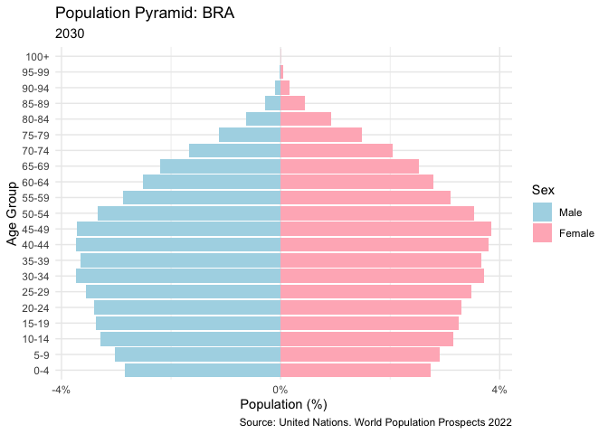

<!-- README.md is generated from README.Rmd. Please edit that file -->

# geopopr

<!-- badges: start -->
<!-- badges: end -->

The goal of geopopr is to …

Ainda em construção … :-(

## Installation

You can install the development version of geopopr from
[GitHub](https://github.com/) with:

``` r
# install.packages("pak")
pak::pak("ghnaves/geopopr")
```

## Example

This is a basic example which shows you how to solve a common problem:

``` r
library(geopopr)
```

You’ll still need to render `README.Rmd` regularly, to keep `README.md`
up-to-date. `devtools::build_readme()` is handy for this.

``` r
pop_pyr('BRA',2030)
```



In that case, don’t forget to commit and push the resulting figure
files, so they display on GitHub and CRAN.

# Estrutura de dados

**GeoPackage**: dados geoespaciais

**SQLite**: metadados e tabelas relacionais

**Parquet:** dados tabulares de grandes dimensões

Arquivos binários grandes (geotiff, etc.) armazenados diretamente no
sistema de arquivos, com os caminhos em banco de dados.

*The combination of some data and an aching desire for an answer does
not ensure that a reasonable answer can be extracted from a given body
of data.*

— John W. Tukey (the first of six “basics” against statistician’s
hubrises) in “Sunset Salvo”, American Statistician, 40, 72–76 (1986).

quoted by the `fortunes` package

# Fonte dos dados

United Nations. (2024). World Population Prospects 2024.
<https://population.un.org/wpp/>
